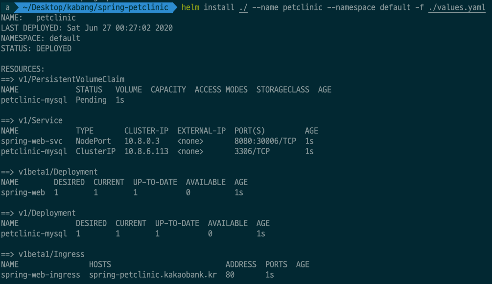
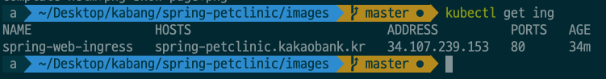
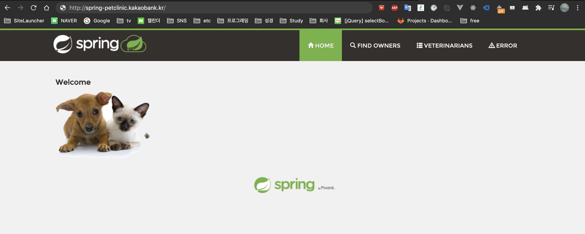

# 실행 조건:
1. k8s cluster구성
2. helm 2.x, 3.x 설치
3. tiller deployment 구성 및 권한 확인
4. nginx-controller 구성
5. pv 사용 가능한 storage-class 구성
6. default namespace 확인
7. worker node에 /logs 디렉토리 생성 확인

# 실행 방법
1. git clone https://github.com/manjoong/spring-petclinic-helm-charts.git
2. cd spring-petclinic-helm-charts
3. values.yaml 수정
4. helm install ./ --name petclinic --namespace default -f ./values.yaml
</img>
5. 'kubectl get all -n default' 명령어를 통해 리소스 생성 확인
6. 'kubectl get ingress -n default' 명령어를 통해 hosts, address확인
</img>
7. host url을 통해 웹페이지 접속
</img>

# values.yaml 수정관련
<pre>
  <code>
  spring:
    image: skekf123/petclinic:1.3 #따로 생성한 이미지를 dockerhub에 업로드 하였습니다.
    securityContext: #uid 1000번으로 프로세스를 실행하기 위해 securityContext를 적용하였습니다.
      enabled: "true"
      fsGroup: 1000
      runAsUser: 1000
      runAsGroup: 1000
    logPath: #log를 hostpath의 /logs에 저장하기 위한 설정 입니다.
      enabled: "true"
      path: "/logs"
    hostUrl: spring-petclinic.kakaobank.kr #nginx-controller를 통한 ingress 통신을 위해 원하는 host url을 명시하는 부분입니다.

  persistence: 
    enabled: false
    storageClass: "-" #mysql db가 유실되지 않게 sc를 통한 pv 볼륨을 사용합니다.
    accessMode: ReadWriteOnce
    size: 8Gi
    annotations: {}
  </code>
</pre>

# 요구사항 관련
### 1. 어플리케이션의 ​log​는 ​host​의 ​/logs ​디렉토리에 적재되도록 한다​.
- 해결방안: hostpath volume mount를 통하여 /log가 host의 특정 디렉토리에 저장되도록 설정 했습니다.
### 2.  정상 동작 여부를 반환하는 ​api​를 구현하며​, 10​초에 한번 체크하도록 한다​. 3​번 연속 체크에 실패하 면 어플리케이션은 ​restart ​된다​.
- 해결방안: liveness probe를 사용하여 curl을 통해 http 통신을 10초 마다 실행했으며, 통신 error 발생 시, pod를 재기동 합니다.
<pre>
  <code>
    livenessProbe:
      exec:
        command:
          - curl
          - -X POST
          - http://localhost:8080
      initialDelaySeconds: 5
      periodSeconds: 10
  </code>
</pre>
### 3. 종료 시 ​30​초 이내에 프로세스가 종료되지 않으면 ​SIGKILL​로 강제 종료 시킨다​.
- 해결방안: lifecycle의 preStop을 통하여 컨테이너가 terminating 상태 일시, 30초 대기 후 kill 명령어를 통해 process를 삭제 합니다.
<pre>
  <code>
    lifecycle:
      preStop:
        exec:
          command: ["/bin/sh","-c","while do sleep 30; kill -9 1; done"]
  </code>
</pre>
### 4. 어플리케이션 프로세스는 ​root ​계정이 아닌 ​uid:1000​으로 실행한다​.
- 해결방안: securityContext를 통해 uid 1000으로 프로세스를 실행합니다.
### 5. DB​도 ​kubernetes​에서 실행하며 재 실행 시에도 변경된 데이터는 유실되지 않도록
설정한다​. ​어플리케이션과 ​DB​는 ​cluster domain​을 이용하여 통신한다​.
- 해결방안: mysql의 고정된 service명(penclinic-mysql)을 통해 app과 db가 통신하게 됩니다. pv를 사용하여 mysql pod가 재기동 되더라도 데이터는 보존하도록 합니다. 
### 6. nginx-ingress-controller​를 통해 어플리케이션에 접속이 가능하다​.
- 해결방안: ingress를 구성하여 nginx-ingress-controller를 통해 접속 가능하게 합니다.
### 7. namespace​는 ​default​를 사용한다​.
- helm 명령어 및 resource에 namespace 선언을 defualt로 실행합니다.

